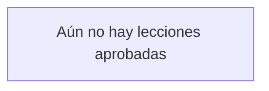
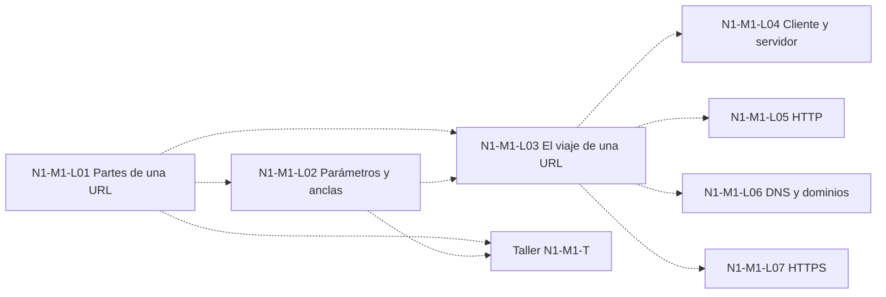

# Mapa mental del recorrido

Este mapa muestra cómo se conectan las lecciones que ya aprendiste.
Crece solo cuando una lección pasa a `aprobada` (✅ en `curriculum/malla.md`).
Lo mantiene `/docente` (ver `.cursor/skills/docente/SKILL.md`, "Cuando una lección pasa a `aprobada`").

**Cómo se actualiza:**
- Se agrega el nodo de la lección aprobada y sus flechas según su sección "Cómo se conecta" (**Viene de**, **Lleva a**, **Si lo combinas con…**).
- Si la lección no tiene esa sección, se agrega solo el nodo y una flecha desde cada uno de sus `prerequisitos`.
- Solo se usan IDs que existan en `curriculum/malla.md`.
- Flecha continua (`-->`): una lección lleva a la otra. Flecha punteada (`-.->`): se combinan para construir algo.
- Cada flecha nueva va también a la tabla de conexiones.

## Mapa de lo aprobado

Todavía no hay lecciones aprobadas. Al aprobar la primera, borra el nodo `vacio`.

## Conexiones

| Desde | Hacia | Tipo | Dónde se dice |
| :-- | :-- | :-- | :-- |

## Próximamente: N1-M1 (no aprobado todavía)

Vista previa de las primeras lecciones, según sus secciones "Cómo se conecta". No es parte del mapa: cuando una lección se apruebe, pasa arriba. Aquí todas las flechas van punteadas porque nada está aprobado.

