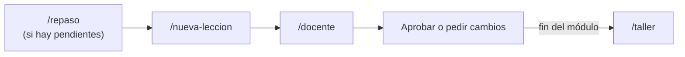

# Cómo usar Aura AI Academy en Cursor

## Primera vez (5 minutos)
1. Abre la carpeta `aura-ai-academy` en Cursor.
2. Abre el chat del Agent (`Cmd + L`) en modo **Agent**.
3. Escribe `/` y comprueba que aparecen `nueva-leccion`, `docente`, `repaso`, `nuevo-taller` y `taller`.
4. Pega esto para comprobar que Cursor leyó las reglas:

```
¿Quién eres en este proyecto y qué subagentes tienes? Responde en 3 líneas.
```

Debe decir que es el orquestador y nombrar a `investigador`, `redactor`, `verificador` y `tallerista`.

5. Configura Grok Bot como investigador: sigue `docs/grok-bot.md` (10 minutos).
6. Haz la prueba de calibración: `docs/prueba-calibracion.md`. Empieza leyendo la lección de referencia `N1-M1-L01`.

Si Cursor marca error en el modelo del verificador (`claude-opus-5`), cambia esa línea de `.cursor/agents/verificador.md` por `model: inherit` y elige un modelo Claude en el selector del chat.

## El ciclo diario



Una lección queda **aprobada** solo después de un `/repaso`: si aciertas 2 de 3 preguntas sobre ella y el formato te funcionó, la docente te propone aprobarla y la suma a `curriculum/mapa.md`. Si te distraes a mitad de lección, la docente te dice en qué bloque vas y cuánto falta.

| Quiero… | Escribo | Tiempo aprox. |
| :-- | :-- | :-- |
| Crear la siguiente lección | `/nueva-leccion` | 5–10 min de espera (los agentes trabajan) |
| Crear una lección concreta | `/nueva-leccion N5-M1-L03` | igual |
| Estudiar con la docente | `/docente` o `/docente N1-M1-L01` | 15–32 min (empieza con 2 preguntas de repaso si hay pendientes) |
| Repasar | `/repaso` | 2 min por lección |
| Practicar con código | `/taller N1-M1-T` | 20–30 min |
| Crear el taller de un módulo | `/nuevo-taller N1-M3-T` | 5–10 min de espera |

**Truco TDAH:** lanza `/nueva-leccion` de la lección de mañana justo al terminar de estudiar la de hoy. Así siempre hay una lista esperando.

## Prompts útiles

**Saber dónde estoy**
```
Lee curriculum/malla.md y aprendizaje/progreso.md. Dime en 3 líneas: nivel actual, última lección estudiada y la siguiente acción.
```

**Ver el mapa completo**
```
Muéstrame curriculum/mapa.md y dime en 2 frases qué temas ya puedo combinar.
```

**No entendí algo**
```
No entendí <concepto> de la lección <ID>. Explícamelo con otra analogía del periodismo y un diagrama Mermaid de máximo 6 nodos.
```

**Ver un concepto en mi propio código**
```
En el proyecto <ruta>, muéstrame un ejemplo real de <concepto de la lección ID>. Señala archivo y línea, y explica qué hace en 3 frases.
```

**Pedir cambios al formato**
```
Revisa aprendizaje/progreso.md. Según mis notas de formato, propón UN cambio a docs/plantilla-leccion.md. No lo apliques todavía.
```

**Una lección salió mal**
```
La lección <ID> tiene este problema: <qué>. Vuelve a pasarla por el verificador con esa observación.
```

## Ahorro de tokens
- Cada subagente trabaja en su propio contexto y devuelve una sola línea. El chat principal no se llena.
- Abre un chat nuevo por cada lección: todo el estado vive en archivos, no en la conversación.
- Si una conversación se alarga, empieza otra con: `Lee progress/current.md y continúa.`

## Dónde vive cada cosa

| Qué | Dónde |
| :-- | :-- |
| Lecciones | `lecciones/N<k>/` |
| Malla y estados | `curriculum/malla.md` |
| Mapa mental de todo lo aprobado | `curriculum/mapa.md` |
| Tu progreso | `aprendizaje/progreso.md` |
| Repasos | `aprendizaje/repasos.md` |
| Glosario | `aprendizaje/glosario.md` |
| Notas de los agentes | `progress/investigacion_*.md`, `progress/verificacion_*.md` |
