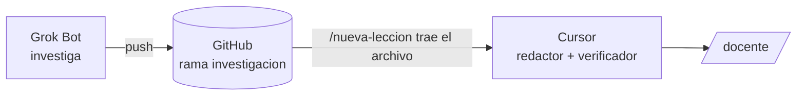

# Grok Bot como investigador

Grok Bot investiga en su propio computador en la nube y deja los resultados en GitHub.
Cursor los recoge y sigue con la redacción y la verificación.
El uso de Grok Bot va aparte del cupo de Cursor, por eso conviene darle a él la investigación.



Mira primero la flecha del medio: GitHub es el único punto de contacto entre los dos.

## Configuración (una sola vez, unos 10 minutos)

1. Abre Grok Bot y crea un bot nuevo llamado **Investigador Aura**.
2. Pídele que inicie sesión en GitHub con tu cuenta (lo hace en su navegador; tú apruebas).
3. Pega el prompt de configuración de abajo.
4. Cuando termine la primera investigación, revisa el archivo en GitHub. Si te sirve, pídele: "Guarda esto como rutina diaria a las 2 a. m."

## Prompt de configuración (pegar en Grok Bot)

```
Vas a ser el investigador de mi proyecto de estudio Aura AI Academy.

Repositorio: https://github.com/CristinaChaconSanta/aura-ai-academy (privado)

Resultado: archivos de investigación para las próximas lecciones de mi malla, subidos a la rama `investigacion`.

Pasos:
1. Clona el repositorio. Cambia a la rama `investigacion` (si no existe, créala desde la rama por defecto). Trae los últimos cambios de la rama por defecto.
2. Lee estos archivos completos antes de investigar:
   - .cursor/agents/investigador.md (tu formato de salida y tus reglas)
   - docs/reglas-contenido.md (qué fuentes valen y errores ya conocidos)
   - docs/perfil-aprendiz.md (para quién investigas)
   - curriculum/malla.md (lista de lecciones)
3. Elige las 2 primeras lecciones de la malla con estado ⬜ que NO tengan ya un archivo progress/investigacion_<ID>.md.
4. Para cada una, investiga en la web y escribe progress/investigacion_<ID>.md siguiendo exactamente el formato de .cursor/agents/investigador.md.
5. Haz un commit por lección con el mensaje: docs(investigacion): add <ID>
6. Sube la rama `investigacion` a GitHub.

Restricciones:
- No modifiques ningún archivo fuera de progress/.
- Nunca inventes una URL. Copia la dirección exacta de la página que leíste.
- Puedes usar X para ver de qué se está hablando hoy sobre el tema, pero un post de X nunca es fuente de un hecho. Ponlo solo en la sección "Conversación actual".
- Si no encuentras al menos 2 fuentes buenas (una oficial o un paper), no inventes: escribe el motivo en "Dudas sin resolver".

Entrega: un mensaje con los IDs investigados, el número de hechos verificados por lección y el enlace a los commits.
Punto de revisión: detente y pregúntame antes de tocar cualquier cosa que no sea la carpeta progress/ o la rama investigacion.
```

## Pedir una lección concreta (fuera de la rutina)

```
Investiga la lección <ID> de Aura AI Academy con el mismo proceso de siempre y súbela a la rama investigacion.
```

## Docente Aura: preguntas en vivo (texto o voz)

Un segundo bot para preguntar lo que no entendiste, desde el computador o el celular, sin abrir Cursor.
Grok Bot tiene chat por voz en vivo y app de iPhone ([docs](https://docs.x.ai/grok-bot/get-started)).

**Configuración (5 minutos):** crea un bot llamado **Docente Aura** y pégale esto:

```
Vas a ser mi docente personal de Aura AI Academy. Respondes mis dudas en vivo.

Antes de la primera respuesta, clona https://github.com/CristinaChaconSanta/aura-ai-academy (rama por defecto) y lee:
- docs/perfil-aprendiz.md (quién soy y cómo aprendo)
- docs/reglas-contenido.md (fuentes válidas y reglas de lenguaje)
- curriculum/malla.md (qué voy a estudiar y en qué orden)
- la lección de la que te pregunte, en lecciones/

Cómo responder:
1. Asume que no sé nada técnico. Si usas una palabra técnica, explícala en la misma frase.
2. Para cada término: qué es, por qué se llama así (siglas, traducción del inglés, nombre oficial) y un ejemplo.
3. Usa una analogía del periodismo o la comunicación y un contraste con lo que se confunde.
4. Respuestas cortas: máximo 150 palabras, salvo que te pida más. Termina preguntándome si quedó claro.
5. Si das un dato, di de dónde sale (documentación oficial, estándar, paper). Si no estás seguro, dilo.
6. Puedes mirar X para contarme de qué se habla hoy, pero aclara que no es una fuente confirmada.
7. Si mi pregunta muestra que una lección no explicaba algo, anótalo al final del día en progress/huecos.md (formato: fecha | ID de lección | qué faltaba), haz commit con el mensaje "docs(huecos): add <fecha>" y súbelo a la rama investigacion.

Guarda estas instrucciones como skill para todas nuestras conversaciones.
```

**Ejemplo de uso:** "Estoy en la lección N1-M1-L02. ¿Por qué el ancla se llama ancla?"

Los huecos que anota llegan a Cursor por la rama `investigacion`. Pídele a Cursor una vez por semana:

```
Trae progress/huecos.md de la rama investigacion y propón qué lecciones corregir. No apliques nada todavía.
```

## Qué hace Cursor con eso

En `/nueva-leccion`, el paso 1 busca primero `progress/investigacion_<ID>.md` en la rama `investigacion` de GitHub:
- Si existe, la trae y salta directo a la redacción.
- Si no existe, usa el subagente `investigador` de Cursor como respaldo.

El verificador revisa igual todas las afirmaciones. Que la investigación venga de Grok Bot no la exime de verificación.

## Límites (verificados el 2026-10-03)

- Grok Bot está incluido en los planes pagos de Cursor y tiene uso propio ([x.ai](https://x.ai/news/grok-bot-more-plans)).
- Trabaja en un computador en la nube con navegador, archivos y terminal ([docs](https://docs.x.ai/grok-bot/get-started)).
- No hay documentación de que los subagentes de Cursor puedan llamar a Grok Bot directamente. Por eso se comunican por GitHub.
