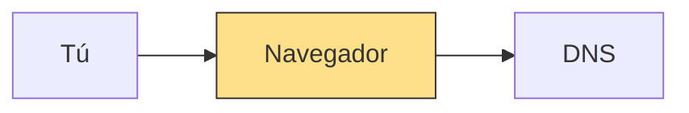
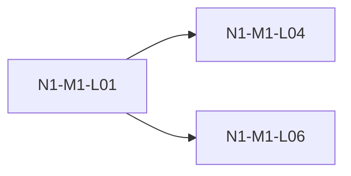

# Plantilla de lección

Toda lección sigue esta forma exacta. `scripts/validate_lessons.py` la comprueba; si no pasa, la lección no existe.

**Ruta:** `lecciones/N<k>/<ID>-<slug>.md`
Ejemplo: `lecciones/N1/N1-M1-L01-las-partes-de-una-url.md`.

**Límites:** 1 concepto, 15–32 minutos (`duracion_min` ≤ 32), máximo 2.200 palabras (sin contar código ni diagramas).
**Glosario:** de 1 a 5 términos. Si el concepto necesita más, divide la lección en dos.
La docente la entrega por bloques, así que el largo no se lee de una sola vez.

**Regla de oro: cero conocimiento previo.** La aprendiz no sabe nada que no esté en esta lección o en una lección de `prerequisitos`. Toda palabra técnica se explica en la sección 3.

**Marcas de tiempo:** cada encabezado `## ` lleva `⏱ <n> min` o `⏱ <n> s` (por ejemplo `## 1. El gancho ⏱ 1 min`). Solo Fuentes va sin marca.

**Repaso espaciado:** no hay campo `repaso` en los metadatos; `/docente` hace el repaso en vivo a partir de `aprendizaje/repasos.md`.

---

## Qué pide cada sección

| # | Sección | ⏱ | Qué exige |
| :-- | :-- | :-- | :-- |
| 1 | El gancho | 1 min | Situación concreta. Termina con "¿Qué crees que pasa cuando...?" sin dar la respuesta. |
| 2 | La idea en una frase | 30 s | Una sola frase en negrita. |
| 3 | Las palabras nuevas | 4 min | Una entrada por término del glosario (máx. 5): **Qué es:**, **Ejemplo:** y "Por qué se llama así" plegado en `<details>`. |
| 4 | La analogía | 2 min | Cierra con "**Dónde se rompe la analogía:**". |
| 5 | Diagrama | 2 min | Frase guía ("Mira primero ...") ARRIBA del Mermaid; ese nodo se resalta con una línea `style`. Máx. 10 nodos. |
| 6 | Contraste | 2 min | Tabla. |
| 7 | ¿Cuál falla? | 3 min | Dos bloques A y B sin etiqueta de bueno o malo. Pregunta "¿Cuál falla y por qué?". Respuesta en `<details>`. |
| 8 | Ponte a prueba | 3 min | Recuerdo, aplicación y detección, más "Explícalo con tus palabras (2 frases) antes de abrir la respuesta". Respuestas en `<details>`. |
| 9 | Mini ejercicio | 5–10 min | El paso 1 dura menos de 1 minuto y no pide instalar, crear cuentas ni configurar nada. Termina con "**Sabrás que lo lograste cuando:**". |
| 10 | Cómo te ayuda a revisar a la IA | 2 min | Incluye un fragmento mostrado como salida de IA: bloque de código o cita que empiece por "Salida de IA:". |
| 11 | Cómo se conecta | 2 min | Obligatoria desde el nivel 2; opcional en el nivel 1. Ver abajo. |
| 12 | Ya puedes | 10 s | Una línea con el logro concreto. |
| 13 | Fuentes | — | Lista plegada en `<details><summary>Fuentes</summary>...</details>`. |

**Ayuda decreciente en "¿Cuál falla?" según el nivel:**
- Nivel 1: la respuesta trae la solución completa, paso a paso.
- Nivel 2: la respuesta deja un paso en blanco para que ella lo complete.
- Nivel 3 en adelante: solo el problema y una pista dentro de `<details>`.

**"Cómo se conecta" tiene cuatro partes:**
- **Viene de:** IDs de lecciones anteriores y cómo se usan aquí.
- **Lleva a:** IDs de lecciones posteriores que dependen de esta.
- **Si lo combinas con…:** qué producto o cosa puedes construir al juntar esto con otro tema, citando IDs.
- Un mini mapa Mermaid con esta lección y sus vecinas (máx. 8 nodos).

Todo ID citado en la sección 11 debe existir en `curriculum/malla.md`; el validador lo comprueba.

---

## Esqueleto (copiar tal cual)

````markdown
---
id: N1-M1-L01
titulo: Qué pasa cuando escribes una URL
nivel: 1
duracion_min: 22
estado: borrador
prerequisitos: []
fuentes:
  - https://developer.mozilla.org/...
  - https://...
glosario: [URL, DNS]
---

## 1. El gancho ⏱ 1 min
Una situación concreta que la aprendiz ya vivió. De 3 a 6 frases, sin definiciones.
Cierra con una pregunta de predicción y no la respondas todavía.
¿Qué crees que pasa cuando escribes una dirección y pulsas Enter?

## 2. La idea en una frase ⏱ 30 s
**Una sola frase en negrita. Si no cabe en una frase, la lección tiene dos conceptos.**

## 3. Las palabras nuevas ⏱ 4 min
Una entrada por cada término del campo `glosario`, con un máximo de 5.

### URL
**Qué es:** explicación en palabras cotidianas, sin otras palabras técnicas sin explicar.

**Ejemplo:** un caso concreto y corto.

<details><summary>Por qué se llama así</summary>
Origen del nombre: siglas, traducción o nombre oficial en el estándar, con fuente.
Si no hay registro claro, dilo y da un truco para recordarlo marcado como truco.
</details>

### DNS
**Qué es:** ...

**Ejemplo:** ...

<details><summary>Por qué se llama así</summary>
...
</details>

## 4. La analogía ⏱ 2 min
Una analogía del periodismo, la comunicación o la vida cotidiana.

**Dónde se rompe la analogía:** toda analogía falla en algún punto; di en cuál.

## 5. Diagrama ⏱ 2 min
Mira primero el nodo Navegador: ahí empieza todo.



## 6. Contraste ⏱ 2 min
Tabla que compara el concepto con lo que se confunde con él.

| | Opción A | Opción B |
| :-- | :-- | :-- |
| ... | ... | ... |

## 7. ¿Cuál falla? ⏱ 3 min
Dos bloques sin etiqueta. Si hay código, máximo 15 líneas por bloque, con comentarios en español.

**A**
```text
https://ejemplo.com/pagina
```

**B**
```text
https//ejemplo.com/pagina
```

¿Cuál falla y por qué?

<details><summary>Respuesta</summary>
Nivel 1: solución completa paso a paso. Nivel 2: deja un paso en blanco. Nivel 3 o más: solo una pista.
</details>

## 8. Ponte a prueba ⏱ 3 min
Explícalo con tus palabras (2 frases) antes de abrir la respuesta.

1. Pregunta de recuerdo (¿qué es...?)
<details><summary>Respuesta</summary>...</details>

2. Pregunta de aplicación (¿qué harías si...?)
<details><summary>Respuesta</summary>...</details>

3. Pregunta de detección (¿qué está mal en...?)
<details><summary>Respuesta</summary>...</details>

## 9. Mini ejercicio ⏱ 5–10 min
Pasos numerados, uno por línea, con resultado visible.

1. Primer paso de menos de 1 minuto, sin instalar nada ni crear cuentas.
2. ...

**Sabrás que lo lograste cuando:** ...

## 10. Cómo te ayuda a revisar a la IA ⏱ 2 min
Muestra un fragmento como si lo hubiera escrito un agente de código y di cómo detectar el error.

> Salida de IA: "El DNS guarda una copia de cada página web."

- Qué está mal y cómo lo notas.

## 11. Cómo se conecta ⏱ 2 min
Obligatoria desde el nivel 2; en el nivel 1 es opcional.

**Viene de:** IDs de lecciones anteriores y cómo se usan aquí.

**Lleva a:** N1-M1-L04, que usa esta idea para explicar quién responde.

**Si lo combinas con…:** N1-M1-L06 para entender por qué tu dominio apunta a tu página.



## 12. Ya puedes ⏱ 10 s
Una línea con el logro concreto.

## 13. Fuentes
<details><summary>Fuentes</summary>

- [Título de la fuente](https://...): qué se tomó de ella
- [Título](https://...): ...

</details>
````

---

## Estados

| Estado | Quién lo pone | Significa |
| :-- | :-- | :-- |
| `borrador` | redactor | Escrita, sin verificar. |
| `verificada` | verificador | Cada afirmación revisada contra fuentes; pasa el validador. |
| `aprobada` | solo la aprendiz | La estudió y el formato le funcionó, Y respondió bien al menos 2 de 3 preguntas sobre ella cuando reapareció en `/repaso` días después. |

---

## Por qué esta forma

- Repaso espaciado y práctica de recuperación (repasos en `/repaso`, "Ponte a prueba"): [Dunlosky et al. 2013](https://www.aft.org/ae/fall2013/dunlosky).
- Pregunta de predicción en el gancho, sin respuesta (efecto de la prueba previa): [Pretesting effect](https://www.structural-learning.com/post/pretesting-effect-testing-before-teaching).
- "¿Cuál falla?" con dos bloques para leer y predecir antes de escribir: [PRIMM](https://computingeducationresearch.org/projects/primm/).
- Palabras nuevas antes de la analogía, guía y nodo resaltado en el diagrama, etimología y fuentes plegadas (preentrenamiento, señalización, coherencia de Mayer): [teoría del aprendizaje multimedia](https://www.growthengineering.co.uk/multimedia-learning-theory/).
- Ayuda que baja con el nivel en "¿Cuál falla?": [expertise reversal effect](https://en.wikipedia.org/wiki/Expertise_reversal_effect).
