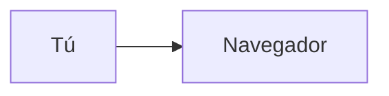

# Plantilla de lección

Toda lección sigue esta forma exacta. `scripts/validate_lessons.py` la comprueba; si no pasa, la lección no existe.

**Ruta:** `lecciones/N<k>/<ID>-<slug>.md`
Ejemplo: `lecciones/N1/N1-M1-L01-que-pasa-cuando-escribes-una-url.md` (es además la lección de referencia).

**Límites:** 1 concepto, 15–25 minutos, máximo 2.200 palabras (sin contar código ni diagramas).
La docente la entrega por bloques, así que el largo no se lee de una sola vez.

**Regla de oro: cero conocimiento previo.** La aprendiz no sabe nada que no esté en esta lección o en una lección de `prerequisitos`. Toda palabra técnica se explica en la sección 3.

---

## Esqueleto (copiar tal cual)

````markdown
---
id: N1-M1-L01
titulo: Qué pasa cuando escribes una URL
nivel: 1
duracion_min: 18
estado: borrador
prerequisitos: []
fuentes:
  - https://developer.mozilla.org/...
  - https://...
glosario: [URL, DNS]
---

## 1. El gancho
Una situación concreta que la aprendiz ya vivió. 3–6 frases. Nada de definiciones aquí.
Si la lección trae muchas palabras nuevas, avísalo: "es normal, la sección 3 las explica".

## 2. La idea en una frase
Una sola frase, en negrita. Si no cabe en una frase, la lección tiene dos conceptos: divídela.

## 3. Las palabras nuevas
Una entrada por cada término del campo `glosario`. Todas con las tres etiquetas.

### URL
**Qué es:** explicación en palabras cotidianas, sin usar otras palabras técnicas sin explicar.

**Por qué se llama así:** de dónde viene el nombre: siglas, traducción del inglés, nombre oficial en el estándar. Con fuente. Si no hay registro claro del origen, dilo y da un truco para recordarlo marcado como truco.

**Ejemplo:** un caso concreto y corto.

### DNS
**Qué es:** ...

**Por qué se llama así:** ...

**Ejemplo:** ...

## 4. La analogía
Una analogía del periodismo, la comunicación o la vida cotidiana.
Cierra con una línea "**Dónde se rompe la analogía:** ..." (toda analogía falla en algún punto).

## 5. Contraste
Tabla que compara el concepto con lo que se confunde con él.

| | Opción A | Opción B |
| :-- | :-- | :-- |
| ... | ... | ... |

## 6. Diagrama
Un diagrama Mermaid. Máximo 10 nodos. Etiquetas en español, cortas.



Debajo, una frase que diga qué mirar primero en el diagrama.

## 7. Bueno vs. malo
Un ejemplo concreto de cómo se hace bien y cómo se hace mal (código, configuración o decisión).
Si hay código: máximo 15 líneas por bloque, con comentarios en español.

## 8. Ponte a prueba
1. Pregunta de recuerdo (¿qué es...?)
<details><summary>Respuesta</summary>...</details>

2. Pregunta de aplicación (¿qué harías si...?)
<details><summary>Respuesta</summary>...</details>

3. Pregunta de detección (¿qué está mal en...?)
<details><summary>Respuesta</summary>...</details>

## 9. Mini ejercicio
Una acción de 5–10 minutos con resultado visible. Pasos numerados, uno por línea.
Termina con "**Sabrás que lo lograste cuando:** ...".

## 10. Cómo te ayuda a revisar a la IA
2–4 viñetas: qué error típico comete un agente de código con este concepto y cómo detectarlo.

## 11. Fuentes
- [Título de la fuente](https://...): qué se tomó de ella
- [Título](https://...): ...
````

---

## Estados

| Estado | Quién lo pone | Significa |
| :-- | :-- | :-- |
| `borrador` | redactor | Escrita, sin verificar. |
| `verificada` | verificador | Cada afirmación revisada contra fuentes; pasa el validador. |
| `aprobada` | solo la aprendiz | La estudió y el formato le funcionó. |
