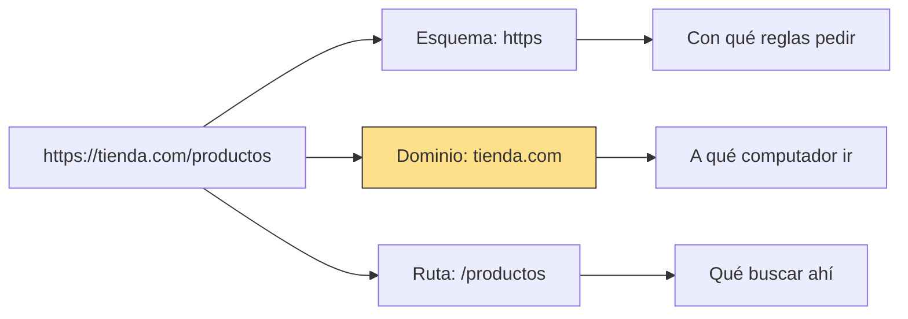
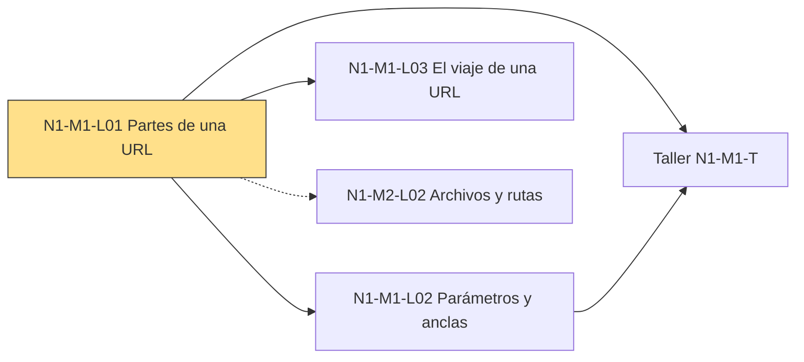

## 1. El gancho ⏱ 1 min
Tu editora te manda por chat un enlace: `https://diario.com/deportes`.
Lo abres y llegas directo a la sección de deportes, no a la portada.

Ese texto parece un solo bloque, pero tiene partes. Cada parte hace un trabajo distinto.
Si una IA te arma un enlace roto, saber cuáles son te deja ver qué parte se dañó.

¿Qué crees que hace cada pedazo de `https://diario.com/deportes`: el que va antes de `://`, el del medio y el que va después de `.com`?

## 2. La idea en una frase ⏱ 30 s
**Una URL es una dirección con partes fijas: el esquema dice con qué reglas pedir, el dominio dice a qué computador ir y la ruta dice qué buscar ahí.**

## 3. Las palabras nuevas ⏱ 4 min
Primero, la dirección que vamos a desarmar:

```text
https://tienda.com/productos
```

Cada palabra de abajo es un pedazo de esa dirección.

### URL
**Qué es:** la dirección completa de algo en internet: una página, una imagen, un video.

**Ejemplo:** `https://tienda.com/productos` es una URL completa.

<details><summary>Por qué se llama así</summary>

Son las siglas en inglés de *Uniform Resource Locator*, que significa "localizador uniforme de recursos".
*Localizador* porque dice dónde está algo. *Uniforme* porque todas siguen las mismas reglas de escritura.
*Recurso* es la palabra técnica para "cualquier cosa que puedes pedir": una página, una foto, un PDF.

</details>

### Esquema
**Qué es:** la primera parte de la URL, antes de `://`. Le dice al navegador (el programa con el que abres páginas, como Chrome o Safari) con qué reglas debe pedir el recurso.

**Ejemplo:** en nuestra URL, el esquema es `https`. En las páginas web casi siempre verás `https` o `http`, su versión sin protección. Hay otros: `mailto:` abre tu programa de correo.

<details><summary>Por qué se llama así</summary>

El estándar oficial de las URL es un documento técnico llamado RFC 3986, publicado en 2005. Ahí esta parte se llama *scheme*.
En ese documento, un *scheme* es un conjunto de reglas para nombrar cosas.
En español se tradujo como "esquema", en el sentido de "sistema" o "plan".

</details>

### Dominio
**Qué es:** el nombre del computador que tiene la página. Va justo después de `://`.

**Ejemplo:** en nuestra URL, el dominio es `tienda.com`.

<details><summary>Por qué se llama así</summary>

Viene del inglés *domain name*, "nombre de dominio".
Es un nombre fácil de recordar que reemplaza un número difícil: los computadores se encuentran entre sí por números. Ese número se llama dirección IP y lo verás en N1-M1-L03.
El estándar oficial llama *authority* (autoridad) a la zona de la URL donde va el dominio.

</details>

### Ruta
**Qué es:** el camino, dentro de ese computador, hasta el recurso que quieres. Empieza con `/`, justo después del dominio.

**Ejemplo:** en nuestra URL, la ruta es `/productos`. En `https://diario.com/deportes/futbol`, la ruta es `/deportes/futbol`.

<details><summary>Por qué se llama así</summary>

En inglés se llama *path*, que significa "camino" o "sendero".
Funciona como las carpetas de tu computador: `Documentos/Fotos/viaje.jpg`.
Según MDN, la documentación web de referencia, en los primeros años de la web la ruta señalaba un archivo real. Hoy casi siempre es una convención que maneja el sitio.

</details>

## 4. La analogía ⏱ 2 min
MDN propone pensar una URL como la dirección de una carta.
Imagina que le escribes a la redacción de un periódico.

Primero eliges cómo enviarla: correo normal o mensajería.
Después escribes la ciudad. Al final, el edificio donde está la redacción.

| En la carta | En la URL |
| :-- | :-- |
| Servicio de correo que eliges | Esquema (`https`) |
| Ciudad | Dominio (`tienda.com`) |
| Edificio | Ruta (`/productos`) |

A la carta le faltan dos datos: el apartamento y la persona. Son las dos partes del final de la URL, y las verás en N1-M1-L02.

**Dónde se rompe la analogía:** el edificio de una carta existe de verdad. La ruta de una URL casi nunca es un lugar real: según MDN, hoy suele ser una convención del sitio, sin un archivo físico detrás.

## 5. Diagrama ⏱ 2 min
Mira primero el nodo Dominio: es la parte que dice a qué computador ir.



## 6. Contraste ⏱ 2 min
Tres palabras que se usan como si fueran lo mismo:

| | URL | Dominio | Ruta |
| :-- | :-- | :-- | :-- |
| Qué es | La dirección completa | El nombre del computador que tiene la página | El camino dentro de ese computador |
| Ejemplo | `https://tienda.com/productos` | `tienda.com` | `/productos` |
| En la carta | Toda la dirección del sobre | La ciudad | El edificio |
| Frase típica | "Mándame la URL de la nota" | "El sitio es tienda.com" | "Está en /productos" |

## 7. ¿Cuál falla? ⏱ 3 min
Una IA te propone dos versiones del mismo enlace para un boletín.

**A**
```text
https://tienda.com/productos
```

**B**
```text
https//tienda.com/productos
```

¿Cuál falla y por qué?

<details><summary>Respuesta</summary>

Falla **B**. Así se resuelve, paso a paso:

1. Busca el esquema: es lo que va antes de `://`.
2. En A encuentras `https` y luego `://`. El esquema es `https`.
3. En B encuentras `https//`: faltan los dos puntos.
4. MDN explica la regla: los dos puntos separan el esquema del resto, y `//` avisa que viene el dominio.
5. Sin los dos puntos, B no tiene esquema. Para el estándar, ya no es una dirección completa.
6. Arreglo: escribir `https://`, con sus dos puntos.

</details>

## 8. Ponte a prueba ⏱ 3 min
Explícalo con tus palabras (2 frases) antes de abrir la respuesta.

1. ¿Qué parte de la URL dice con qué reglas pedir el recurso?
<details><summary>Respuesta</summary>El esquema: lo que va antes de `://`, como `https`.</details>

2. En `https://diario.com/deportes/futbol`, ¿cuál es el esquema, el dominio y la ruta?
<details><summary>Respuesta</summary>Esquema: `https`. Dominio: `diario.com`. Ruta: `/deportes/futbol`.</details>

3. Una IA te dice: "En `https://tienda.com/productos`, el dominio es `productos`". ¿Qué está mal?
<details><summary>Respuesta</summary>`productos` es parte de la ruta. El dominio va justo después de `://` y antes de la siguiente `/`: es `tienda.com`.</details>

## 9. Mini ejercicio ⏱ 5 min
1. Haz clic en la barra de direcciones de la página que tienes abierta ahora mismo para ver la URL completa.
2. Señala con el dedo el esquema, el dominio y la ruta.
3. Abre `https://developer.mozilla.org/en-US/docs/Learn_web_development` y repite: esquema, dominio, ruta.
4. Borra todo lo que va después del dominio, deja solo `https://developer.mozilla.org` y pulsa Enter.

**Sabrás que lo lograste cuando:** puedas decir en voz alta las tres partes de la URL de MDN (esquema `https`, dominio `developer.mozilla.org`, ruta `/en-US/docs/Learn_web_development`) y veas que, sin esa ruta, llegas a otra página del mismo sitio.

## 10. Cómo te ayuda a revisar a la IA ⏱ 2 min
Cuando le pidas a una IA que arme un enlace, revisa las tres partes por separado.

> Salida de IA: "Listo. El enlace a tu portafolio es `https:/miportafolio.com/proyectos`."

- Mira el separador entre el esquema y el dominio: aquí hay una sola `/`. MDN explica que `//` es lo que avisa que viene el dominio. Con una sola barra, falta esa señal.
- Pídele a la IA que te muestre el enlace dividido en esquema, dominio y ruta. Así ves de un vistazo si alguna parte quedó mal escrita.
- Si la IA dice "la URL es `tienda.com`", corrígela: eso es solo el dominio. Una URL completa empieza con su esquema.

## 11. Cómo se conecta ⏱ 2 min
**Viene de:** ninguna lección. Es el punto de partida del recorrido.

**Lleva a:** N1-M1-L02, que explica las dos partes del final de la URL (parámetros y ancla). También N1-M1-L03, que sigue el viaje del dominio cuando pulsas Enter.

**Si lo combinas con…:** N1-M1-L02, tienes las cinco partes de una URL y puedes resolver el taller N1-M1-T, un programa que desarma una URL. Con N1-M2-L02 (archivos, carpetas y rutas) verás por qué la ruta de una URL se parece a la de un archivo en tu computador.



## 12. Ya puedes ⏱ 10 s
Ya puedes desarmar una URL en esquema, dominio y ruta, y detectar cuándo una IA rompe el separador `://`.

## 13. Fuentes
<details><summary>Fuentes</summary>

- [What is a URL? (MDN)](https://developer.mozilla.org/en-US/docs/Learn_web_development/Howto/Web_mechanics/What_is_a_URL): partes de una URL; `:` separa el esquema y `//` anuncia el dominio; esquemas `http`, `https` y `mailto:`; analogía de la carta; la ruta antes era un archivo real y hoy es sobre todo una convención del sitio.
- [RFC 3986: URI Generic Syntax (2005)](https://www.rfc-editor.org/rfc/rfc3986): nombres oficiales *scheme*, *authority* y *path*; el esquema termina en `:`.
- [URL (MDN Glossary)](https://developer.mozilla.org/en-US/docs/Glossary/URL): significado de *Uniform Resource Locator*.
- [How the web works (MDN)](https://developer.mozilla.org/en-US/docs/Learn_web_development/Getting_started/Web_standards/How_the_web_works): las direcciones reales de la web son números; el dominio es el nombre fácil de recordar.

</details>
