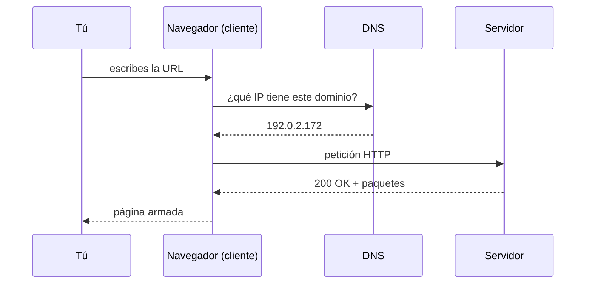

## 1. El gancho
Escribes `elespectador.com` y en un segundo tienes la portada en pantalla.
Parece instantáneo, pero en ese segundo tu navegador hizo varias cosas, una detrás de otra.

Cuando una web "no carga", el problema está en uno de esos pasos.
Si sabes cuáles son y cómo se llaman, puedes preguntarle a la IA algo concreto en lugar de "no funciona".

Esta lección tiene muchas palabras nuevas. Es normal. La sección 3 las explica una por una, con el origen de cada nombre.

## 2. La idea en una frase
**El navegador traduce el nombre del sitio a un número, le pide la página al computador que tiene ese número y arma lo que recibe en pedazos.**

## 3. Las palabras nuevas
Primero, la dirección completa que vamos a desarmar:

```text
https://tienda.com/productos?categoria=libros#resenas
```

Cada palabra de abajo es un pedazo de esa dirección o un actor del viaje.

### URL
**Qué es:** la dirección completa de algo en internet: una página, una imagen, un video.

**Por qué se llama así:** son las siglas en inglés de *Uniform Resource Locator*, que significa "localizador uniforme de recursos". *Localizador* porque dice dónde está algo. *Uniforme* porque todas siguen las mismas reglas de escritura. *Recurso* es la palabra técnica para "cualquier cosa que puedes pedir": una página, una foto, un PDF.

**Ejemplo:** `https://tienda.com/productos?categoria=libros#resenas` es una URL completa.

### Esquema
**Qué es:** la primera parte de la URL, antes de `://`. Le dice al navegador con qué reglas debe pedir el recurso.

**Por qué se llama así:** el estándar oficial de las URL (un documento técnico llamado RFC 3986, publicado en 2005) lo llama *scheme*. En ese documento, un *scheme* es un conjunto de reglas para nombrar cosas. En español se tradujo como "esquema", en el sentido de "sistema" o "plan".

**Ejemplo:** en nuestra URL, el esquema es `https`. Significa "pide esto con las reglas de HTTP, en su versión segura".

### Dominio
**Qué es:** el nombre del computador que tiene la página.

**Por qué se llama así:** viene del inglés *domain name*, "nombre de dominio". Es un nombre fácil de recordar que reemplaza un número difícil (la dirección IP, más abajo).

**Ejemplo:** `tienda.com`. El estándar oficial llama a esta parte *authority* (autoridad).

### Ruta
**Qué es:** el camino dentro del servidor hasta el recurso que quieres.

**Por qué se llama así:** en inglés se llama *path*, que significa "camino" o "sendero". Funciona como las carpetas de tu computador: `Documentos/Fotos/viaje.jpg`.

**Ejemplo:** `/productos`.

### Parámetros
**Qué es:** datos extra que le mandas al servidor para afinar el pedido. Empiezan con `?` y van en pares `nombre=valor`. Si hay varios, se separan con `&`.

**Por qué se llama así:** el estándar oficial lo llama *query*, que significa "consulta". En español se popularizó "parámetros" porque cada par es un ajuste de la consulta, como los filtros de una búsqueda. Truco para recordarlo: el `?` marca el momento en que la URL "hace una pregunta".

**Ejemplo:** `?categoria=libros` le dice al servidor "de los productos, muéstrame solo los libros". Con dos parámetros sería `?categoria=libros&orden=precio`.

### Ancla
**Qué es:** la última parte, después de `#`. Señala un punto exacto dentro de la página.

**Por qué se llama así:** el estándar oficial lo llama *fragment*, "fragmento", porque apunta a un pedazo del recurso. MDN, la documentación web de referencia, lo llama *anchor*, "ancla". En HTML, los enlaces se escriben con el elemento `<a>`, que se llama *anchor element*, y sirven también para saltar a una sección de la misma página. Truco para recordarlo: un ancla fija el barco en un punto; esta parte fija la pantalla en un punto de la página.

**Ejemplo:** `#resenas` hace que el navegador baje directo a la sección de reseñas.

### Cliente y servidor
**Qué es:** el *cliente* es quien pide (tu navegador). El *servidor* es el computador que responde y entrega la página.

**Por qué se llama así:** como en un negocio. El cliente pide un servicio y el servidor lo sirve. MDN usa la imagen de una carretera: en una punta está tu casa (el cliente) y en la otra, la tienda (el servidor).

**Ejemplo:** tu Chrome es el cliente. El computador de `tienda.com` es el servidor.

### DNS
**Qué es:** el sistema que traduce un dominio a una dirección IP.

**Por qué se llama así:** son las siglas de *Domain Name System*, "sistema de nombres de dominio". MDN lo compara con la libreta de direcciones de los sitios web.

**Ejemplo:** le preguntas al DNS por `mozilla.org` y te responde con un número como `192.0.2.172`.

### Dirección IP
**Qué es:** el número que identifica a un computador en internet. Los computadores se encuentran entre sí por ese número, no por el nombre.

**Por qué se llama así:** IP son las siglas de *Internet Protocol*, "protocolo de internet". Un *protocolo* es un conjunto de reglas de comunicación. La dirección IP es la dirección que usan esas reglas.

**Ejemplo:** `192.0.2.172`.

### HTTP
**Qué es:** las reglas de conversación entre el navegador y el servidor: cómo se pide una página y cómo se responde.

**Por qué se llama así:** son las siglas de *HyperText Transfer Protocol*, "protocolo de transferencia de hipertexto". *Hipertexto* es texto con enlaces a otros textos, en lugar de un hilo lineal como el de una novela. El término lo acuñó Ted Nelson hacia 1965. HTTPS es la misma conversación, pero cifrada: la S viene de *Secure*, "seguro".

**Ejemplo:** el navegador manda "dame la página `/productos`" y el servidor contesta `200 OK`, que significa "sí, aquí va".

### Paquete
**Qué es:** cada uno de los pedazos pequeños en que viaja la información por internet.

**Por qué se llama así:** en inglés, *packet*, "paquetito". Cada uno lleva una etiqueta (llamada *header*, "encabezado") con datos como de dónde viene, a dónde va y qué número de pedazo es. Dentro va el contenido, que se llama *payload*, "carga".

**Ejemplo:** una página llega en muchos paquetes. Pueden llegar desordenados, y el navegador los vuelve a ordenar con los números de las etiquetas.

## 4. La analogía
Piensa en pedirle una foto a una agencia de noticias.

Sabes el nombre de la agencia, pero no su número de teléfono.
Buscas el número en el directorio, llamas y haces el pedido formal.
La agencia te manda la foto por partes numeradas.
Tú las juntas en orden y ya tienes la imagen completa.

| En la agencia | En internet |
| :-- | :-- |
| Nombre de la agencia | Dominio (`elespectador.com`) |
| Directorio telefónico | DNS |
| Número de teléfono | Dirección IP |
| Pedido formal | Petición HTTP |
| "Sí, aquí va" | Respuesta `200 OK` |
| Partes numeradas | Paquetes |

**Dónde se rompe la analogía:** en la agencia una persona decide si te atiende. En internet, el servidor es un programa que responde solo, sin que nadie revise tu pedido a mano.

## 5. Contraste
Tres palabras que se usan como si fueran lo mismo:

| | URL | Dominio | Dirección IP |
| :-- | :-- | :-- | :-- |
| Qué es | La dirección completa de un recurso | El nombre del servidor | El número real del servidor |
| Ejemplo | `https://tienda.com/productos?categoria=libros` | `tienda.com` | `192.0.2.172` |
| Quién la usa | Tú, al escribir o compartir un enlace | Tú y el DNS | Los computadores entre sí |
| En la agencia | La dirección con piso y oficina | El nombre de la agencia | El número de teléfono |

## 6. Diagrama



Mira primero la columna del DNS. El navegador no puede hablar con el servidor hasta que el DNS le da el número.

## 7. Bueno vs. malo
Cada parte de la URL llega a un lugar distinto. Esto confunde incluso a la IA.

```text
https://tienda.com/productos?categoria=libros#resenas
└─┬─┘   └───┬────┘└───┬───┘└────────┬───────┘└──┬──┘
esquema  dominio    ruta       parámetros      ancla
```

**Mal entendido:** "El servidor recibe `#resenas` y por eso muestra las reseñas".

**Bien entendido:** el servidor recibe la ruta `/productos` y el parámetro `categoria=libros`. El ancla `#resenas` nunca viaja al servidor: el navegador la separa antes de enviar el pedido. El estándar oficial lo dice así: el fragmento lo usa solo el programa del usuario. El navegador la usa para saltar a esa parte de la página.

## 8. Ponte a prueba
1. ¿Qué hace el DNS y por qué hace falta?
<details><summary>Respuesta</summary>Traduce el dominio (un nombre fácil de recordar) a la dirección IP (el número que usan los computadores). Hace falta porque los computadores se encuentran por número, no por nombre.</details>

2. En `https://diario.com/deportes?fecha=hoy#futbol`, ¿cuál es el esquema, la ruta, el parámetro y el ancla?
<details><summary>Respuesta</summary>Esquema: `https`. Ruta: `/deportes`. Parámetro: `fecha=hoy`. Ancla: `futbol`. El dominio es `diario.com`.</details>

3. Una IA escribe un código de servidor que lee lo que viene después del `#` en la URL para decidir qué mostrar. ¿Qué está mal?
<details><summary>Respuesta</summary>El ancla nunca se envía al servidor. Ese código nunca va a recibir el dato. La información tendría que ir en la ruta o en un parámetro con `?`.</details>

## 9. Mini ejercicio
1. Abre Chrome y entra a `developer.mozilla.org/en-US/search?q=URL`.
2. Mira la barra de direcciones y señala con el dedo el esquema, el dominio, la ruta y el parámetro.
3. Abre las herramientas de desarrollador con `Cmd + Option + I` y ve a la pestaña **Network**.
4. Recarga la página y mira la columna **Status** de la primera fila.

**Sabrás que lo lograste cuando:** puedas decir en voz alta qué es `q=URL` (un parámetro: le pide al buscador de MDN que busque la palabra "URL") y veas el número `200` en la pestaña Network.

## 10. Cómo te ayuda a revisar a la IA
- Si una IA dice "el sitio está caído", pregúntale en qué paso falló: DNS, conexión o respuesta del servidor. Cada uno se arregla distinto.
- Si una IA propone mandar datos al servidor con `#`, recházalo. Esos datos nunca llegan.
- Si una IA pone una dirección IP fija en el código en vez del dominio, pregunta por qué. Lo habitual es usar el dominio y dejar que el DNS haga la traducción.
- Si una IA mete datos privados (como un correo o una contraseña) en los parámetros de una URL, detenla. La URL queda a la vista en la barra de direcciones.

## 11. Fuentes
- [How the web works (MDN)](https://developer.mozilla.org/en-US/docs/Learn_web_development/Getting_started/Web_standards/How_the_web_works): pasos DNS, HTTP, 200 OK, paquetes con encabezado y carga; analogía de la carretera; ejemplo de IP.
- [What is a URL? (MDN)](https://developer.mozilla.org/en-US/docs/Learn_web_development/Howto/Web_mechanics/What_is_a_URL): partes de una URL, parámetros con `?` y `&`, nombre *anchor*.
- [RFC 3986: URI Generic Syntax (2005)](https://www.rfc-editor.org/rfc/rfc3986): nombres oficiales *scheme*, *authority*, *path*, *query* y *fragment*; el fragmento no se envía al servidor.
- [URL (MDN Glossary)](https://developer.mozilla.org/en-US/docs/Glossary/URL): significado de *Uniform Resource Locator*.
- [HTTP (MDN Glossary)](https://developer.mozilla.org/en-US/docs/Glossary/HTTP): significado de *HyperText Transfer Protocol*.
- [The anchor element (MDN)](https://developer.mozilla.org/en-US/docs/Web/HTML/Reference/Elements/a): el elemento `<a>` se llama *anchor* y enlaza a secciones de la misma página.
- [HTTPS (MDN Glossary)](https://developer.mozilla.org/en-US/docs/Glossary/HTTPS): *HyperText Transfer Protocol Secure*, versión cifrada de HTTP.
- [Hypertext (MDN Glossary)](https://developer.mozilla.org/en-US/docs/Glossary/Hypertext): definición de hipertexto y su origen (Ted Nelson, hacia 1965).
