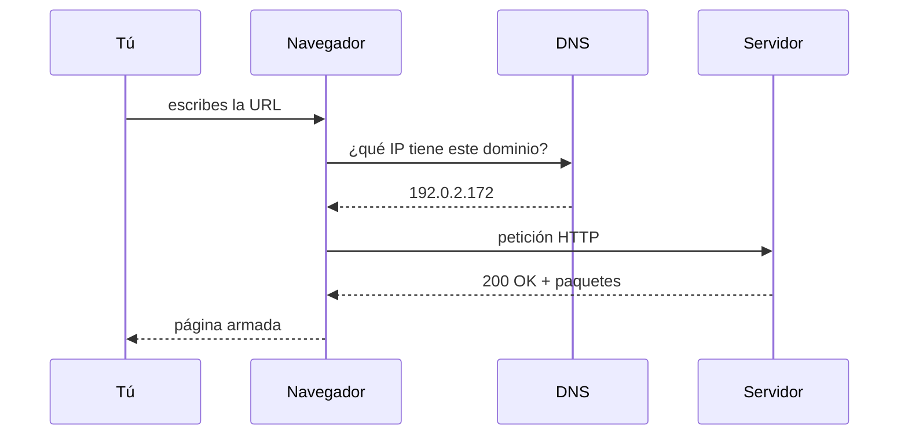

## 1. El gancho
Escribes `elespectador.com` y en un segundo tienes la portada en pantalla.
Parece instantáneo, pero en ese segundo tu navegador hizo cinco cosas distintas.
Cuando una web "no carga", el problema está en uno de esos cinco pasos.
Si sabes cuáles son, sabes qué preguntarle a la IA.

## 2. La idea en una frase
**El navegador traduce el nombre del sitio a un número, le pide la página a ese computador y arma lo que recibe en pedazos.**

## 3. La analogía
Piensa en pedirle una foto a una agencia de noticias.
Sabes el nombre de la agencia, pero no su número de teléfono.
Buscas el número en el directorio, llamas, haces el pedido formal y la agencia te manda la foto por partes numeradas.
Tú las juntas en orden y ya tienes la imagen completa.

| En la agencia | En internet |
| :-- | :-- |
| Nombre de la agencia | Dominio (`elespectador.com`) |
| Directorio telefónico | DNS |
| Número de teléfono | Dirección IP |
| Pedido formal | Petición HTTP |
| "Sí, aquí va" | Respuesta `200 OK` |
| Partes numeradas | Paquetes |

**Dónde se rompe la analogía:** en la agencia una persona decide si te atiende. En internet, el servidor es un programa que responde solo, sin que nadie revise tu pedido a mano.

## 4. Contraste
Tres palabras que se usan como si fueran lo mismo:

| | URL | Dominio | Dirección IP |
| :-- | :-- | :-- | :-- |
| Qué es | La dirección completa de un recurso | El nombre del servidor | El número real del servidor |
| Ejemplo | `https://developer.mozilla.org/en-US/search?q=URL` | `developer.mozilla.org` | `192.0.2.172` |
| Quién la usa | Tú, al escribir o compartir un enlace | Tú y el DNS | Los computadores entre sí |
| Analogía | La dirección con piso y oficina | El nombre de la empresa | El número de teléfono |

## 5. Diagrama



Mira primero la columna del DNS: el navegador no puede hablar con el servidor hasta que el DNS le da el número.

## 6. Bueno vs. malo
Una URL tiene partes, y cada parte llega a un lugar distinto.

```text
https://tienda.com/productos?categoria=libros#resenas
└─┬─┘   └───┬────┘└───┬───┘└────────┬───────┘└──┬──┘
esquema  dominio    ruta       parámetros      ancla
```

**Mal entendido:** "El servidor recibe `#resenas` y por eso muestra las reseñas".

**Bien entendido:** el servidor recibe la ruta `/productos` y el parámetro `categoria=libros`. El ancla `#resenas` nunca viaja al servidor. El navegador la usa para saltar a esa parte de la página.

## 7. Ponte a prueba
1. ¿Qué hace el DNS en este proceso?
<details><summary>Respuesta</summary>Convierte el nombre del dominio en la dirección IP del servidor. Funciona como el directorio telefónico de internet.</details>

2. Una página no carga y el navegador dice que no encuentra el dominio. ¿En qué paso del diagrama está el problema?
<details><summary>Respuesta</summary>En la consulta al DNS. El navegador nunca consiguió la IP, así que ni siquiera llegó a pedirle la página al servidor.</details>

3. Una IA escribe un código de servidor que lee lo que viene después del `#` en la URL para decidir qué mostrar. ¿Qué está mal?
<details><summary>Respuesta</summary>El ancla (lo que va después del #) nunca se envía al servidor. Ese código nunca va a recibir el dato. La información tendría que ir en la ruta o en un parámetro con `?`.</details>

## 8. Mini ejercicio
1. Abre Chrome y entra a `developer.mozilla.org`.
2. Abre las herramientas de desarrollador con `Cmd + Option + I` y ve a la pestaña **Network**.
3. Recarga la página.
4. Busca la primera fila de la lista y mira la columna **Status**.

**Sabrás que lo lograste cuando:** veas el número `200` en esa fila. Es la respuesta del servidor diciendo "sí, aquí va".

## 9. Cómo te ayuda a revisar a la IA
- Si una IA dice "el sitio está caído", pregúntale en qué paso falló: DNS, conexión o respuesta del servidor. Cada uno se arregla distinto.
- Si una IA propone mandar datos al servidor con `#`, recházalo. Esos datos nunca llegan.
- Si una IA pone una dirección IP fija en el código en vez del dominio, pregunta por qué. Lo normal es usar el dominio y dejar que el DNS haga la traducción.

## 10. Fuentes
- [How the web works (MDN)](https://developer.mozilla.org/en-US/docs/Learn_web_development/Getting_started/Web_standards/How_the_web_works): pasos DNS, HTTP, respuesta 200 OK y paquetes; ejemplo de IP.
- [What is a URL? (MDN)](https://developer.mozilla.org/en-US/docs/Learn_web_development/Howto/Web_mechanics/What_is_a_URL): partes de una URL; el ancla no se envía al servidor.
