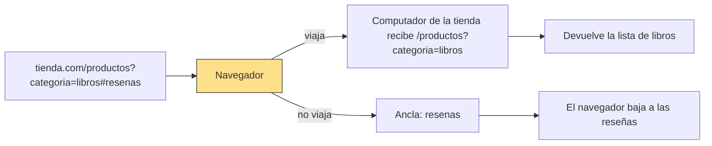
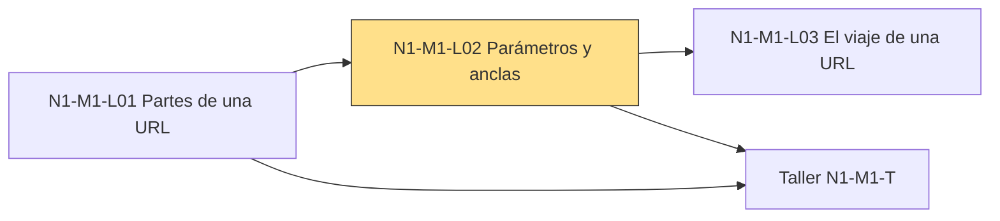

## 1. El gancho ⏱ 1 min
Buscas libros en una tienda en línea, filtras por categoría y copias el enlace para mandárselo a tu hermana.
Ella lo abre y ve la misma lista filtrada, no la tienda entera.

Otro día, alguien te manda el enlace a un artículo largo. La página se abre justo en la sección que importa.
Las dos cosas dependen de lo que va al final de la URL: después de un `?` o de un `#`.

¿Qué crees que pasa con lo que va después del `#` cuando pulsas Enter: viaja hasta el computador de la tienda o se queda en tu navegador?

## 2. La idea en una frase ⏱ 30 s
**Lo que va después de `?` viaja al computador del sitio para afinar el pedido; lo que va después de `#` no viaja con el pedido y le señala a tu navegador un punto dentro de la página.**

## 3. Las palabras nuevas ⏱ 2 min
En N1-M1-L01 desarmaste el esquema, el dominio y la ruta. Esta es la misma dirección, con sus dos últimas partes:

```text
https://tienda.com/productos?categoria=libros#resenas
```

En esta lección, "el computador del sitio" es el computador que tiene la página. En N1-M1-L03 verás que se llama servidor.

### Parámetros
**Qué es:** datos extra que le mandas al computador del sitio para afinar el pedido. Empiezan con `?` y van en pares `nombre=valor`. Si hay varios, se separan con `&`.

**Ejemplo:** `?categoria=libros` le dice a la tienda "de los productos, muéstrame solo los libros". Con dos parámetros sería `?categoria=libros&orden=precio`.

<details><summary>Por qué se llama así</summary>

El estándar oficial de las URL (RFC 3986) llama a toda esta parte *query*, que significa "consulta".
El nombre "parámetros" no nació en español: MDN, en inglés, los llama *parameters*. Cada par `nombre=valor` es uno de ellos.
Truco para recordarlo: el `?` marca el momento en que la URL "hace una pregunta".

</details>

### Ancla
**Qué es:** la última parte, después de `#`. Señala un punto exacto dentro de la página. MDN la describe como una especie de marcador dentro del recurso.

**Ejemplo:** `#resenas` hace que el navegador baje directo a la sección de reseñas. En un video o un audio, el navegador intenta saltar al momento que indica el ancla.

<details><summary>Por qué se llama así</summary>

El estándar oficial lo llama *fragment*, "fragmento", porque apunta a un pedazo del recurso.
MDN, la documentación web de referencia, lo llama *anchor*, "ancla".

En HTML, el lenguaje con el que se escriben las páginas, los enlaces se marcan con la etiqueta `<a>` (una marca entre `< >` que le dice al navegador "esto es un enlace"). Se llama *anchor element* y sirve también para saltar a una sección de la misma página.
Truco para recordarlo: un ancla fija el barco en un punto; esta parte fija la pantalla en un punto de la página.

</details>

## 4. La analogía ⏱ 2 min
En N1-M1-L01 viste que MDN compara la URL con la dirección de una carta. El esquema es el servicio de correo, el dominio es la ciudad y la ruta es el edificio.
MDN completa la imagen con las dos partes que faltaban.

| En la carta | En la URL |
| :-- | :-- |
| Número del apartamento | Parámetros (`?categoria=libros`) |
| Persona a quien va dirigida | Ancla (`#resenas`) |

El apartamento afina la entrega: no basta con el edificio. Los parámetros hacen lo mismo con el pedido.

**Dónde se rompe la analogía:** en la carta, el cartero lee el nombre de la persona. En la web, el ancla no viaja con el pedido al computador del sitio. Solo la usa tu navegador.

## 5. Diagrama ⏱ 2 min
Mira primero el nodo Navegador: ahí la URL se parte en dos caminos.



## 6. Contraste ⏱ 2 min
Las dos partes del final de la URL, frente a frente:

| | Parámetros | Ancla |
| :-- | :-- | :-- |
| Símbolo | `?` al inicio y `&` entre pares | `#` |
| Ejemplo | `?categoria=libros` | `#resenas` |
| ¿Viaja al computador del sitio? | Sí | No viaja con el pedido |
| Quién la usa | El computador del sitio, para afinar lo que devuelve | El navegador, para saltar a un punto |
| Nombre en el estándar | *query* (consulta) | *fragment* (fragmento) |
| En la carta | Número del apartamento | Persona a quien va dirigida |

## 7. ¿Cuál falla? ⏱ 3 min
Quieres compartir un enlace que muestre solo los libros de la tienda. Una IA te ofrece dos opciones.

**A**
```text
https://tienda.com/productos#categoria=libros
```

**B**
```text
https://tienda.com/productos?categoria=libros
```

¿Cuál falla y por qué?

<details><summary>Respuesta</summary>

Falla **A**. Así se resuelve, paso a paso:

1. Encuentra el símbolo que abre el dato extra. En A es `#`; en B es `?`.
2. Pregunta quién necesita ese dato: el computador de la tienda, porque es quien elige qué productos devolver.
3. Revisa qué viaja. Lo que va después de `?` llega al computador del sitio. Lo que va después de `#` no: MDN dice que nunca se envía con el pedido.
4. En A, la tienda recibe solo `/productos`. No se entera de que querías libros.
5. Arreglo: cambiar `#` por `?`, como en B.

</details>

## 8. Ponte a prueba ⏱ 3 min
Explícalo con tus palabras (2 frases) antes de abrir la respuesta.

1. ¿Qué símbolo separa dos parámetros dentro de una URL?
<details><summary>Respuesta</summary>El `&`. Por ejemplo: `?categoria=libros&orden=precio`.</details>

2. En `https://diario.com/deportes?fecha=hoy#futbol`, ¿cuál es el parámetro, cuál es el ancla y cuál de los dos llega al computador del diario?
<details><summary>Respuesta</summary>Parámetro: `fecha=hoy`, y sí llega. Ancla: `futbol`, y no llega: el navegador la usa para bajar a esa parte de la página.</details>

3. Una IA escribe un programa para el computador de la tienda que lee lo que viene después del `#` para decidir qué mostrar. ¿Qué está mal?
<details><summary>Respuesta</summary>El ancla no viaja con el pedido al computador del sitio. Ese programa nunca va a recibir el dato. La información tendría que ir en la ruta o en un parámetro con `?`.</details>

## 9. Mini ejercicio ⏱ 5 min
1. Abre `developer.mozilla.org/en-US/search?q=URL` y encuentra en la barra de direcciones el `?` y el parámetro `q=URL`.
2. Cambia `q=URL` por `q=HTTP` en la barra y pulsa Enter. Mira cómo cambian los resultados.
3. Abre `developer.mozilla.org/en-US/docs/Learn_web_development/Howto/Web_mechanics/What_is_a_URL#anchor`.
4. Fíjate en dónde queda la pantalla: no arriba del todo, sino en la sección "Anchor".

**Sabrás que lo lograste cuando:** puedas decir qué es `q=URL` (un parámetro: le pide al buscador de MDN que busque la palabra "URL") y la página de MDN se abra sola en la sección "Anchor".

## 10. Cómo te ayuda a revisar a la IA ⏱ 2 min
Este es el tipo de respuesta que debes frenar:

> Salida de IA: "Para que la tienda muestre solo los libros, agrega `#categoria=libros` al final del enlace."

- Qué está mal: usa `#`, y el ancla no viaja con el pedido al computador de la tienda. El dato tiene que ir como parámetro: `?categoria=libros`.
- Si la IA inventa un parámetro, como `?orden=barato`, pregúntale de dónde lo sacó. MDN advierte que cada sitio tiene sus propias reglas sobre parámetros. La única forma segura de saber cuáles entiende es preguntarle a quien lo administra.
- Si la IA mete datos privados (como un correo o una contraseña) en los parámetros, detenla. La URL queda a la vista en la barra de direcciones. Además, según OWASP (la fundación de referencia en seguridad web), queda guardada en el historial del navegador y en los registros del sitio.

## 11. Cómo se conecta ⏱ 2 min
**Viene de:** N1-M1-L01, que te dio el esquema, el dominio y la ruta. Aquí completas la URL con sus dos últimas partes.

**Lleva a:** N1-M1-L03, que sigue el viaje de la URL cuando pulsas Enter y le pone nombre al computador que recibe los parámetros.

**Si lo combinas con…:** N1-M1-L01, tienes las cinco partes de una URL que más vas a ver y puedes resolver el taller N1-M1-T. Su reto te pide escribir una función (un pedacito de programa que recibe datos y devuelve un resultado) que lee un parámetro por su nombre.

Existe una sexta parte, el *puerto* (`:80`), que verás más adelante. Casi siempre va escondida.



## 12. Ya puedes ⏱ 10 s
Ya puedes distinguir qué parte del final de una URL viaja al sitio (`?`) y cuál no viaja con el pedido (`#`).

## 13. Fuentes
<details><summary>Fuentes</summary>

- [What is a URL? (MDN)](https://developer.mozilla.org/en-US/docs/Learn_web_development/Howto/Web_mechanics/What_is_a_URL): parámetros con `?` y `&`; el servidor los usa y cada uno tiene sus reglas. El ancla como marcador, también en video y audio; lo que va después de `#` nunca se envía con el pedido. Analogía de la carta (apartamento y persona). Llama *parameters* a los pares `nombre=valor`; el puerto (`:80`) casi siempre se omite.
- [RFC 3986: URI Generic Syntax (2005)](https://www.rfc-editor.org/rfc/rfc3986): nombres oficiales *query* y *fragment*; el fragmento lo usa solo el programa del usuario.
- [The anchor element (MDN)](https://developer.mozilla.org/en-US/docs/Web/HTML/Reference/Elements/a): el elemento `<a>` se llama *anchor* y enlaza a secciones de la misma página.
- [Information exposure through query strings in URL (OWASP)](https://community.owasp.org/vulnerabilities/Information_exposure_through_query_strings_in_url): los datos de los parámetros quedan expuestos en el historial del navegador, la caché y los registros del servidor web.

</details>
