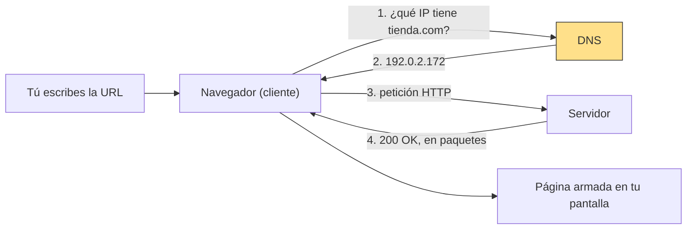
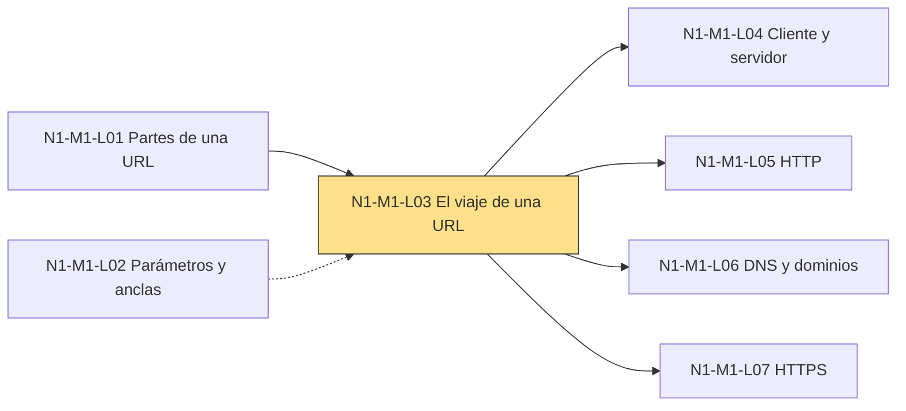

## 1. El gancho ⏱ 1 min
Escribes `elespectador.com` y en un segundo tienes la portada en pantalla.
Parece instantáneo, pero en ese segundo tu navegador hizo varias cosas, una detrás de otra.

Cuando una web "no carga", el problema está en uno de esos pasos.
Si sabes cuáles son y cómo se llaman, puedes preguntarle a la IA algo concreto en lugar de "no funciona".

¿Qué crees que pasa entre el momento en que pulsas Enter y el momento en que ves la portada?

## 2. La idea en una frase ⏱ 30 s
**El navegador traduce el nombre del sitio a un número, le pide la página al computador que tiene ese número y arma lo que recibe en pedazos.**

## 3. Las palabras nuevas ⏱ 5 min
Esta lección tiene cinco palabras nuevas. Cada una es un actor o una pieza del viaje.
Usaremos la dirección de N1-M1-L01, donde ya separaste esquema, dominio y ruta:

```text
https://tienda.com/productos
```

### Cliente y servidor
**Qué es:** el *cliente* es quien pide (tu navegador). El *servidor* es el computador que responde y entrega la página. Ese computador tiene un programa encendido cuyo trabajo es contestar pedidos.

**Ejemplo:** tu Chrome es el cliente. El computador de `tienda.com` es el servidor.

<details><summary>Por qué se llama así</summary>

**Truco:** piensa en un negocio. El cliente pide un servicio y el servidor lo sirve.
MDN, la documentación web de referencia, usa la imagen de una carretera: en una punta está tu casa (el cliente) y en la otra, la tienda (el servidor).

</details>

### DNS
**Qué es:** el sistema que traduce un dominio a una dirección IP.

**Ejemplo:** le preguntas al DNS por `tienda.com` y te responde con un número como `192.0.2.172`. Ese número es de ejemplo: está reservado para documentos y manuales, no es la dirección real de ningún sitio.

<details><summary>Por qué se llama así</summary>

Son las siglas de *Domain Name System*, "sistema de nombres de dominio".
MDN lo compara con la libreta de direcciones de los sitios web.

</details>

### Dirección IP
**Qué es:** el número que identifica a un computador en internet. Los computadores se encuentran entre sí por ese número, no por el nombre.

**Ejemplo:** `192.0.2.172`.

<details><summary>Por qué se llama así</summary>

IP son las siglas de *Internet Protocol*, "protocolo de internet".
Un *protocolo* es un conjunto de reglas de comunicación. La dirección IP es la dirección que usan esas reglas.

</details>

### HTTP
**Qué es:** las reglas de conversación entre el navegador y el servidor: cómo se pide una página y cómo se responde.

**Ejemplo:** el navegador manda "dame la página `/productos`" y el servidor contesta `200 OK`, que significa "sí, aquí va".

<details><summary>Por qué se llama así</summary>

Son las siglas de *HyperText Transfer Protocol*, "protocolo de transferencia de hipertexto".
*Hipertexto* es texto con enlaces a otros textos, en lugar de un hilo lineal como el de una novela. El término lo acuñó Ted Nelson hacia 1965.
HTTPS es la misma conversación, pero cifrada (escrita en un código que nadie más puede leer en el camino). La S viene de *Secure*, "seguro".

</details>

### Paquete
**Qué es:** cada uno de los pedazos pequeños en que viaja la información por internet.

**Ejemplo:** una página llega en muchos paquetes. Pueden llegar desordenados, y tu computador los vuelve a ordenar con los números de las etiquetas.

<details><summary>Por qué se llama así</summary>

En inglés, *packet*, "paquetito": viene de *pack* ("bulto") con una terminación que lo hace pequeño. Al principio nombraba los paquetes de cartas oficiales.
Cada uno lleva una etiqueta numerada con datos como de dónde viene, a dónde va y qué número de pedazo es.

</details>

## 4. La analogía ⏱ 2 min
Piensa en pedirle una foto a una agencia de noticias.

Sabes el nombre de la agencia, pero no su número de teléfono.
Buscas el número en el directorio, llamas y haces el pedido formal.
La agencia te manda la foto por partes numeradas.
Tú las juntas en orden y ya tienes la imagen completa.

| En la agencia | En internet |
| :-- | :-- |
| Nombre de la agencia | Dominio (`tienda.com`) |
| Directorio telefónico | DNS |
| Número de teléfono | Dirección IP |
| Pedido formal | Petición HTTP |
| "Sí, aquí va" | Respuesta `200 OK` |
| Partes numeradas | Paquetes |

**Dónde se rompe la analogía:** en la agencia una persona decide si te atiende. En internet, el servidor es un computador con un programa que responde solo, sin que nadie revise tu pedido a mano.

## 5. Diagrama ⏱ 2 min
Mira primero el nodo DNS: el navegador no puede hablar con el servidor hasta que el DNS le da el número.



## 6. Contraste ⏱ 2 min
Tres palabras que se usan como si fueran lo mismo:

| | URL | Dominio | Dirección IP |
| :-- | :-- | :-- | :-- |
| Qué es | La dirección completa de un recurso | El nombre del servidor | El número real del servidor |
| Ejemplo | `https://tienda.com/productos` | `tienda.com` | `192.0.2.172` |
| Quién la usa | Tú, al escribir o compartir un enlace | Tú y el DNS | Los computadores entre sí |
| En la agencia | La dirección con piso y oficina | El nombre de la agencia | El número de teléfono |

## 7. ¿Cuál falla? ⏱ 3 min
Una IA te resume el viaje de una URL de dos maneras.

**A**
```text
1. El navegador le pide la página al servidor de tienda.com
2. El DNS traduce tienda.com a una dirección IP
3. El servidor responde 200 OK y la página llega en paquetes
```

**B**
```text
1. El DNS traduce tienda.com a una dirección IP
2. El navegador le pide la página al servidor (petición HTTP)
3. El servidor responde 200 OK y la página llega en paquetes
```

¿Cuál falla y por qué?

<details><summary>Respuesta</summary>

Falla **A**. Así se resuelve, paso a paso:

1. Pregúntate qué necesita el navegador para hablar con el servidor: su número, la dirección IP.
2. Busca en qué paso consigue ese número: cuando el DNS traduce el dominio.
3. En A, el paso 1 pide la página antes de tener el número. Ese paso todavía no se puede hacer.
4. En B, primero el DNS entrega el número y después sale la petición. Así lo cuenta MDN.
5. Conclusión: A tiene los pasos en desorden. El DNS va primero.

</details>

## 8. Ponte a prueba ⏱ 3 min
Explícalo con tus palabras (2 frases) antes de abrir la respuesta.

1. ¿Qué hace el DNS y por qué hace falta?
<details><summary>Respuesta</summary>Traduce el dominio (un nombre fácil de recordar) a la dirección IP (el número que usan los computadores). Hace falta porque los computadores se encuentran por número, no por nombre.</details>

2. Una web no carga y una IA te dice "el sitio está caído". ¿Qué le preguntarías?
<details><summary>Respuesta</summary>En qué paso falló: el DNS (no encontró el número), la petición HTTP o la respuesta del servidor. Cada uno se arregla distinto.</details>

3. Una IA escribe un programa que se conecta a `192.0.2.172` en vez de a `tienda.com`. ¿Qué está mal?
<details><summary>Respuesta</summary>Puso una dirección IP fija en lugar del dominio. Además, `192.0.2.172` es un número reservado para ejemplos en documentos: no es la dirección real de `tienda.com` ni de ningún sitio. Pregúntale de dónde sacó ese número.</details>

## 9. Mini ejercicio ⏱ 5 min
1. En Chrome, abre `https://developer.mozilla.org/en-US/`.
2. Abre las herramientas de desarrollador con `Cmd + Option + I`. Son un panel del navegador que muestra por dentro la página y todo lo que pidió.
3. Ve a la pestaña **Network** (red): ahí aparece una fila por cada cosa que el navegador pidió, con su estado.
4. Recarga sin usar copias guardadas con `Cmd + Shift + R` y mira la columna **Status** (estado) de la primera fila.

**Sabrás que lo lograste cuando:** veas `200` en la columna Status y puedas decir qué significa: "sí, aquí va". Si ves `304` también está bien: significa "no cambió, usa la copia que ya tienes".

## 10. Cómo te ayuda a revisar a la IA ⏱ 2 min
Cuando algo no carga, este es el tipo de diagnóstico que no te sirve:

> Salida de IA: "Tu sitio está caído. Vuelve a intentarlo más tarde."

- Pregúntale en qué paso falló: DNS, petición HTTP o respuesta del servidor. Cada uno se arregla distinto.
- Si una IA pone una dirección IP fija en el código en vez del dominio, pregunta de dónde sacó ese número. Si es `192.0.2.172`, es un número de ejemplo, no la dirección real de ningún sitio.

## 11. Cómo se conecta ⏱ 2 min
**Viene de:** N1-M1-L01. El dominio que aprendiste a separar es el nombre que el DNS traduce a número.

**Lleva a:** cada paso del viaje tiene su lección propia. N1-M1-L04 (cliente y servidor), N1-M1-L05 (HTTP y sus códigos, como el 200), N1-M1-L06 (DNS y dominios) y N1-M1-L07 (HTTPS y certificados).

**Si lo combinas con…:** N1-M1-L02, sabes qué parte de la URL viaja en la petición y cuál se queda en tu navegador. Los parámetros llegan al servidor; el ancla no viaja con el pedido.



## 12. Ya puedes ⏱ 10 s
Ya puedes contar en cuatro pasos qué pasa entre pulsar Enter y ver una página, y preguntarle a la IA en cuál falló.

## 13. Fuentes
<details><summary>Fuentes</summary>

- [How the web works (MDN)](https://developer.mozilla.org/en-US/docs/Learn_web_development/Getting_started/Web_standards/How_the_web_works): pasos DNS, HTTP, 200 OK, paquetes con etiqueta; analogía de la carretera; libreta de direcciones; ejemplo de IP.
- [HTTP (MDN Glossary)](https://developer.mozilla.org/en-US/docs/Glossary/HTTP): significado de *HyperText Transfer Protocol*.
- [HTTPS (MDN Glossary)](https://developer.mozilla.org/en-US/docs/Glossary/HTTPS): *HyperText Transfer Protocol Secure*, versión cifrada de HTTP.
- [Hypertext (MDN Glossary)](https://developer.mozilla.org/en-US/docs/Glossary/Hypertext): definición de hipertexto y su origen (Ted Nelson, hacia 1965).
- [What is a URL? (MDN)](https://developer.mozilla.org/en-US/docs/Learn_web_development/Howto/Web_mechanics/What_is_a_URL): los parámetros los recibe el servidor; lo que va después de `#` nunca se envía con el pedido.
- [RFC 5737: IPv4 Address Blocks Reserved for Documentation](https://www.rfc-editor.org/rfc/rfc5737): `192.0.2.0/24` está reservado para documentación y no debe aparecer en internet.
- [packet (Etymonline)](https://www.etymonline.com/word/packet): de *pack* más el diminutivo *-et*, "paquete pequeño"; primero se usó para envíos de cartas oficiales.
- [304 Not Modified (MDN)](https://developer.mozilla.org/en-US/docs/Web/HTTP/Reference/Status/304): la copia guardada sigue siendo válida; no hace falta enviarla de nuevo.
- [What are browser developer tools? (MDN)](https://developer.mozilla.org/en-US/docs/Learn_web_development/Howto/Tools_and_setup/What_are_browser_developer_tools): qué son las herramientas de desarrollador; atajo `Cmd + Option + I` en macOS.
- [Chrome keyboard shortcuts (Google)](https://support.google.com/chrome/answer/157179): `Cmd + Shift + R` recarga la página sin usar el contenido guardado.

</details>
