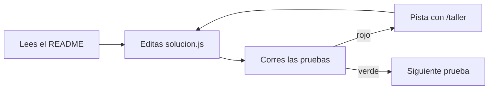

# Talleres

Un taller por módulo de la malla. Las lecciones te enseñan a **entender** el código; los talleres te enseñan a **escribirlo**.

## Cómo funciona un taller

Mira primero el lazo entre "Editas" y "Corres las pruebas": aprender a codear es dar esa vuelta muchas veces.

## Qué hay en cada carpeta

| Archivo | Qué es | ¿Lo tocas? |
| :-- | :-- | :-- |
| `README.md` | El enunciado: qué practicas y qué lograr | Solo lo lees |
| `solucion.js` | Tu código. Viene a medias, con pistas en los comentarios | **Sí, solo este** |
| `pruebas.js` | Pruebas ya escritas que dicen si tu código funciona | No |
| `index.html` | Abre las pruebas en el navegador, en verde y rojo | No, solo lo abres |
| `.referencia/solucion.js` | Una solución posible | No lo abras: la docente te la muestra si la pides |

## Dos formas de correr las pruebas

1. **Navegador:** abre `index.html` con doble clic. Cada vez que guardes `solucion.js`, recarga la página.
2. **Terminal:** desde la carpeta del proyecto, escribe `node talleres/<carpeta>/pruebas.js`.

## Tipos de taller

| Tipo | Cuándo | Cómo se ve |
| :-- | :-- | :-- |
| **Código** | Módulos que enseñan algo programable | JavaScript con pruebas |
| **Práctica guiada** | Módulos conceptuales (metodologías, estrategia, leyes) | Ejercicio con IA o en papel, con checklist en el README |

## Comandos en Cursor

| Quiero… | Escribo |
| :-- | :-- |
| Resolver un taller con ayuda | `/taller N1-M1-T` |
| Crear el taller de un módulo | `/nuevo-taller N1-M3-T` |

## Reglas para quien crea talleres

- Carpeta: `talleres/<ID>-<slug>/`, con `<ID>` = `N<k>-M<m>-T`.
- Archivos obligatorios: los cinco de la tabla de arriba. `tests/test_talleres.py` los exige y corre cada taller contra su referencia.
- Copia la estructura de `talleres/N1-M1-T-desarma-una-url/`, que es el taller de referencia.
- Las pruebas usan `talleres/_lib/mini-prueba.js`: funcionan igual en Node y en el navegador.
